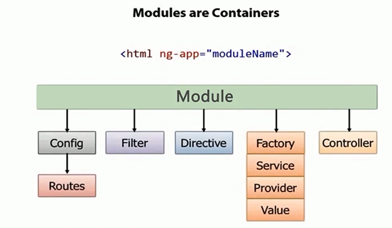

# AngularJS实战

- AngularJS的4大核心特性
- 搭建开发环境、调试、测试环境

- MVC
- 模块化与依赖注入
- 双向数据绑定
- 指令
- Service
- Provider
- 表单

- Parser
- 双向数据绑定
- 依赖注入

- AngularJS-UI
- 移动端控件库ionic

- TDD
- Jasmine与Protractor

## 4大核心特性

- MVC
- 模块化
- 指令系统
- 双向数据绑定

### 核心1：MVC

Model Controller View

起源：1979年，TR第一次正式提出了MVC模式

Model：数据模型层
View：视图层，负责展示
Controller：业务逻辑和控制权逻辑

好处：职责清晰，代码模块化

问题：为什么23种设计模式里面没有MVC?

### 模块化

### 指令

- 自定义标签
- 指令

### 双向数据绑定

单向数据绑定： JQ UI、BackBone、Flex

问题：
1. 双向数据绑定如何实现
2. 缺点

## 搭建开发、调试、测试环境

为什么需要前端开发工具
- 代码编辑
- 断点调试
- 版本管理
- 代码合并和混淆
- 依赖管理工具
- 单元测试工具
- 集成测试

目标：自动化、工业化

工具：
- nodejs
- sublime
- webstorm
- batarang：chrome插件
- git
- git小乌龟

- grunt：及相关插件的使用
- bower
- http-server
- karma：单元测试
- jasmine
- Protractor：集成测试

