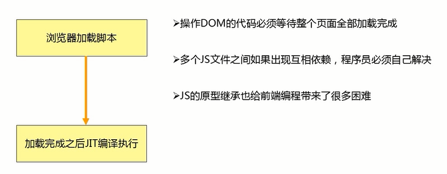
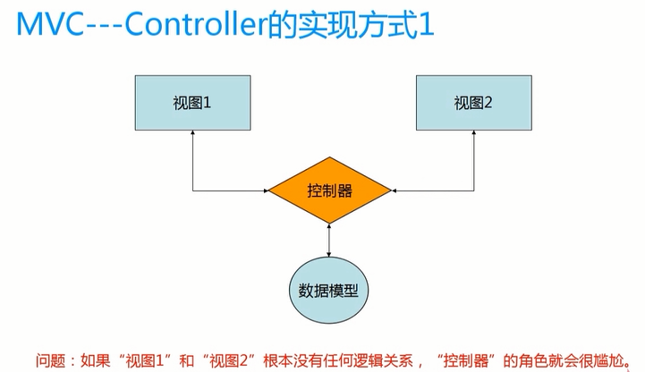
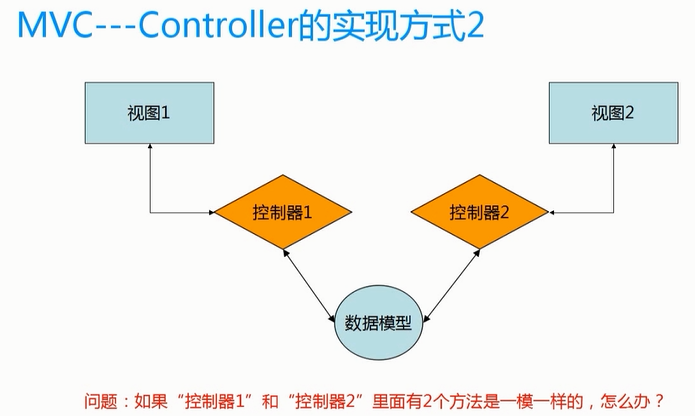
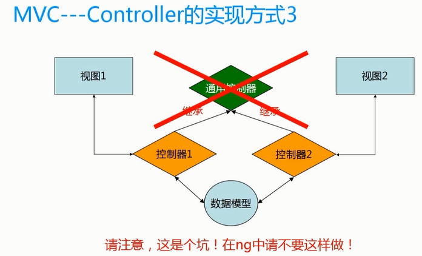
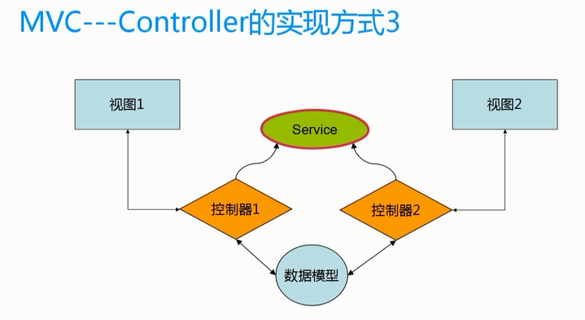
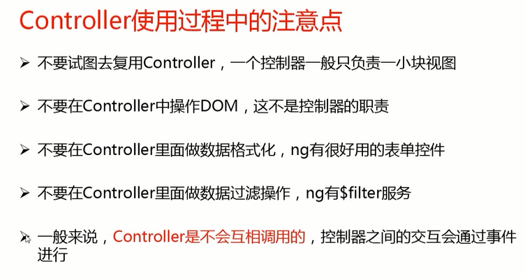
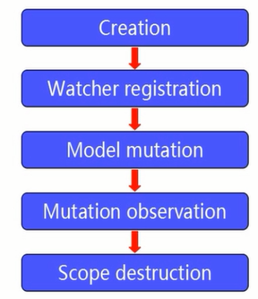

# MVC

- 为什么要MVC
- 前端MVC的困难在哪里
- ng语言环境下的mvc是如何实现的

为什么要MVC?

- 代码规模越来越大，切分职责是大势所趋
- 为了复用：很多逻辑是一样的
- 为了后期维护方便：修改一个模块不影响其他功能

`MVC只是手段，终极目标是模块化和复用`

前端MVC的困难在哪里

## AngularJS 的 Controller

## Model

一般绑定在$scope上的

## View

如何复用？

利用Directive实现view的复用

`注：AngularJS的MVC是借助于$scope实现的`

## 神奇的 $scope

- $scope 是一个POJO（Plain Old JavaScript Object）
- $scope 提供了一些工具方法 $watch()/$apply()
- $scope 是表达式的执行环境（或者叫作用域）
- $scope 是一个树形结构，与DOM标签平级
- 子 $scope 对象会继承 父 $scope 上的属性和方法
- 每个Angular 应用只有一个根$scope 对象（一般位于ng-app上）
- $scope 可以传播事件，类似于DOm事件，可以向上也可以向下
- $scope 布局是 MVC 的基础，也是后面实现双向数据绑定的基础
- 可以用 angular.element($0).scope进行调试

插件: 
- inscpect Angular Scope
- AngularJS Inspect Watchers
- ng-inspect for AngularJS
- AngularJS Inspector

## $scope 的生命周期

