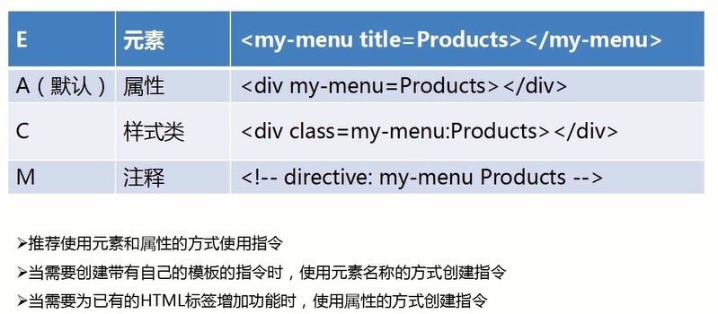
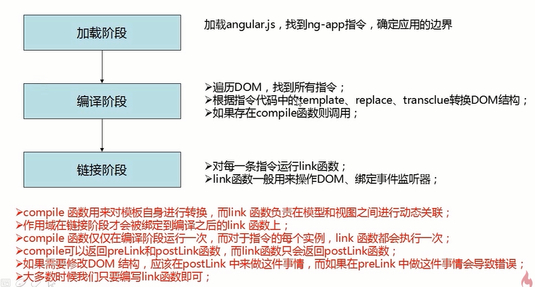
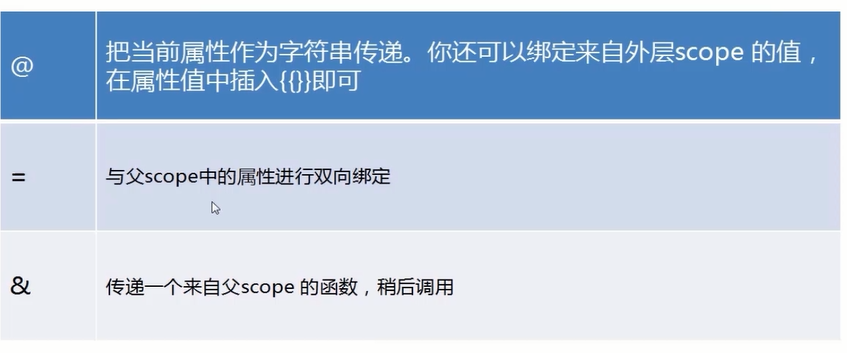
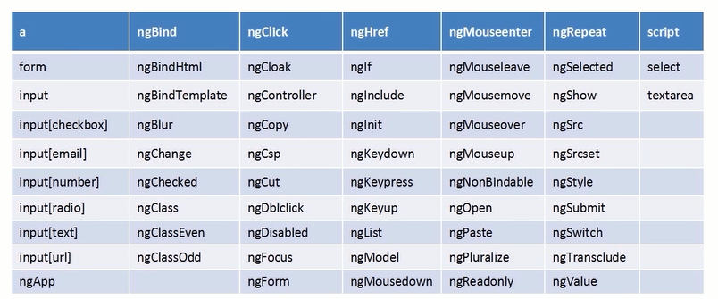
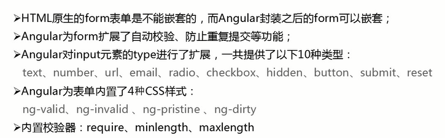

# 指定


- 指令：匹配模式restrict
- template、templateUrl、$templateCache
- replace、transclude
- comile与link(操作元素、添加样式、绑定事件)
- 指令与控制器之间的交互
- 指令之间的交互
- scope的类型与独立scope
- scope的绑定策略
- ng内置的指令（60+个）
- 
- 指令的运行原理：compile和link
- ERP类型的UI组件
- 电商系统必备的组件
- angular-ui
- Directive思想的起源和原理


## 匹配模式restrict

AEMC

- E 元素的方式匹配,`<hello></hello>`
- A 自定义属性，`<div hello></div>`
- C 样式名称，`<div class="hello"></div>`
- M 注释

```html
<!-- directive:hello -->
<div></div>
```




transclude: true


## comile与link




## scope的绑定策略




## 内置指令




## form指令




## Directive思想的起源和原理


- [专访AngularJS框架创始人Misko Hevery：让Web开发更便捷](https://www.csdn.net/article/2013-10-08/2817118-AngularJS-Framework-Google)


